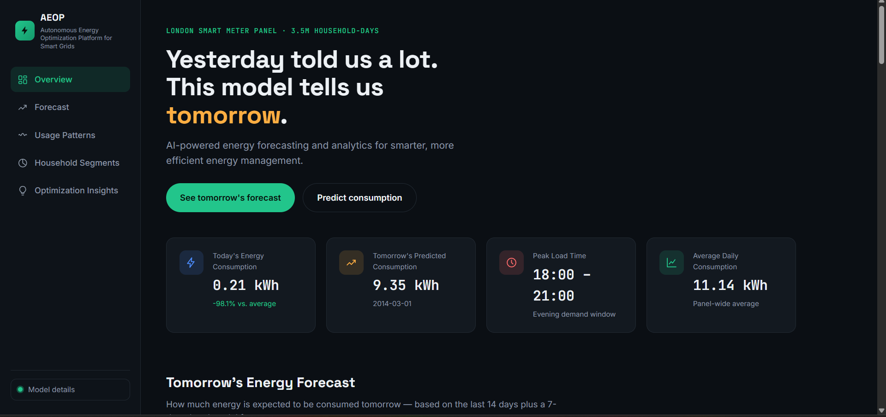
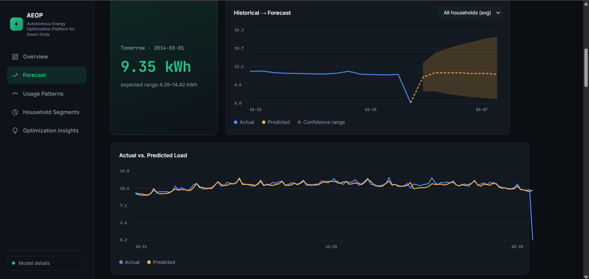
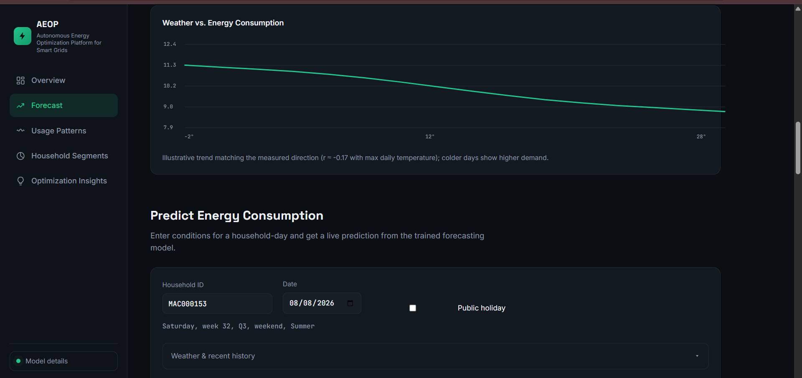
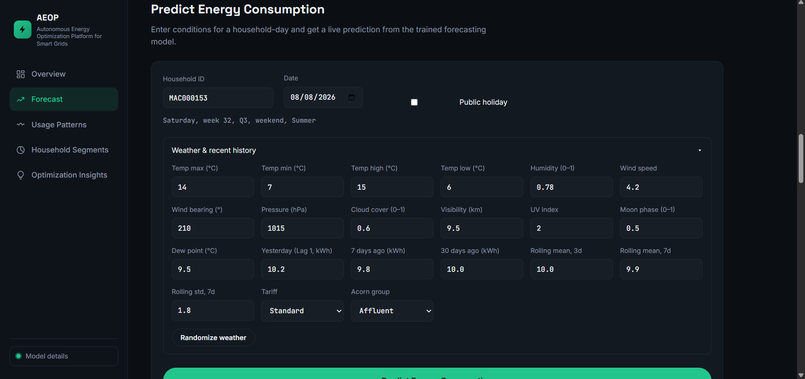
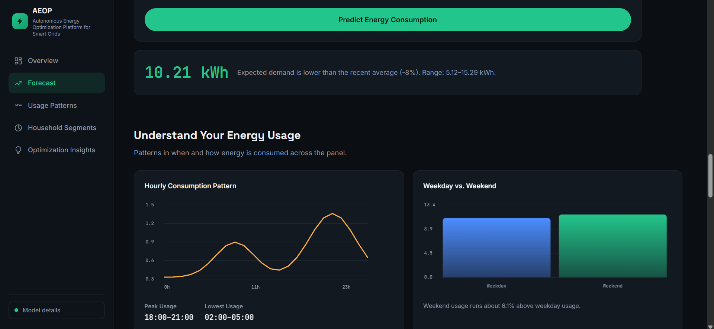
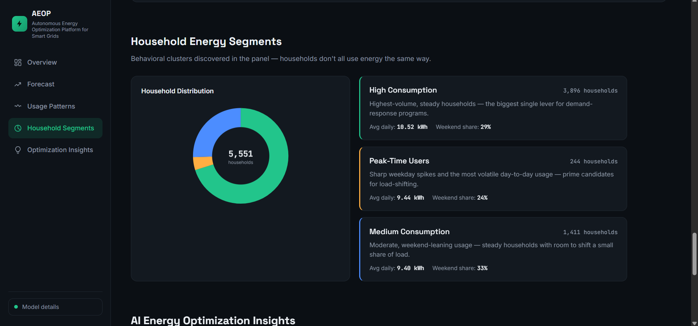
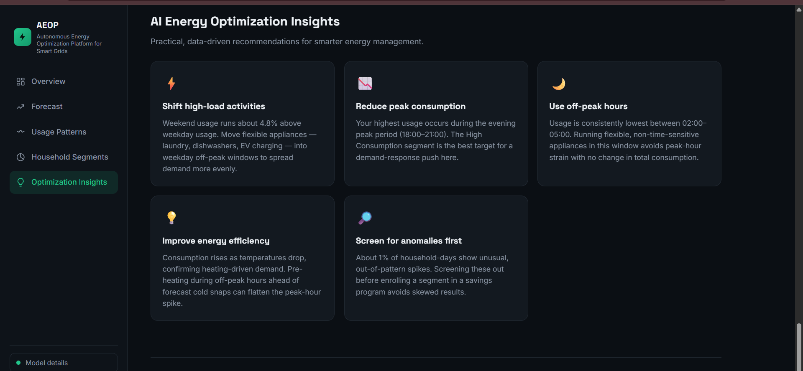
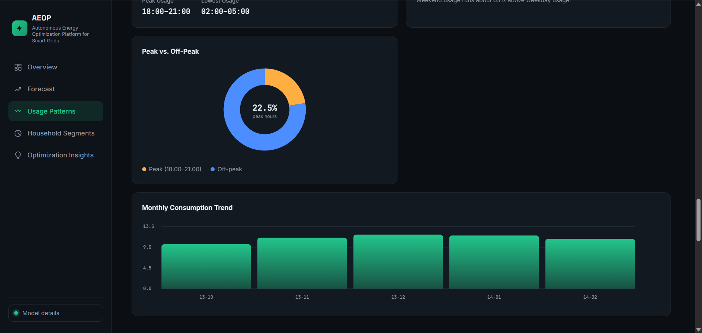
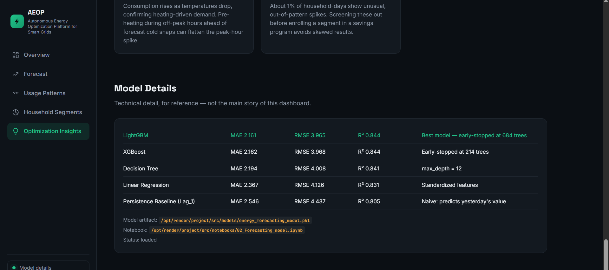

# ⚡ Autonomous Energy Optimization Platform for Smart Grids

**🚀 Live Demo:** [Autonomous Energy Optimization Platform](https://autonomous-energy-optimization-platform.onrender.com/)

> **Note:** The app is deployed on Render's free tier, so it may take 30–60 seconds to wake up on the first request after a period of inactivity.

An end-to-end machine learning platform that forecasts household-level energy consumption from the London Smart Meter panel, segments households into behavioral clusters, and surfaces actionable optimization insights through an interactive web dashboard.

---

## 📊 Overview

This project turns raw smart meter + weather data into a full analytics product:

* **Data pipeline** — Cleaning, merging, and feature engineering on ~3.5M household-days of smart meter readings and weather data.
* **Forecasting model** — A trained LightGBM model that predicts next-day and 7-day-ahead household energy consumption.
* **Household segmentation** — K-Means clustering that groups households into behavioral tiers: High Consumption, Peak-Time Users, and Medium Consumption.
* **Interactive dashboard** — A Flask web app with live charts, a "Predict Your Own Consumption" tool, usage-pattern breakdowns, and AI-generated optimization recommendations.

---

## 🧠 Model Performance

Multiple models were trained and compared using a chronological train/validation/test split. The best-performing model was selected for deployment.

| Model                        |      MAE |     RMSE |        R² |
| ---------------------------- | -------: | -------: | --------: |
| **LightGBM (Selected)**      | **2.16** | **3.96** | **0.844** |
| XGBoost                      |     2.16 |     3.97 |     0.844 |
| Decision Tree                |     2.19 |     4.01 |     0.841 |
| Linear Regression            |     2.37 |     4.13 |     0.831 |
| Persistence Baseline (Lag_1) |     2.55 |     4.44 |     0.805 |

The final **LightGBM regression model**, early-stopped at 684 trees, is used to power both the historical accuracy charts and the live **Predict Energy Consumption** tool on the dashboard.

### 🏆 Key Result

The selected LightGBM model achieves an **R² of 0.844**, outperforming the persistence baseline with an approximately **10.6% lower MAE**.

---

## 🏠 Household Segments

Using silhouette-selected K-Means clustering (`k=3`) on household usage behavior, households were grouped into three behavioral segments:

### 🔴 High Consumption

Highest-volume and relatively steady-consumption households. These households represent the biggest opportunity for demand-response and efficiency programs.

### 🟠 Peak-Time Users

Households with sharper weekday spikes and more volatile day-to-day consumption. They are prime candidates for load-shifting strategies.

### 🟢 Medium Consumption

Households with moderate consumption and more weekend-oriented usage patterns, with opportunities to shift a portion of their load.

---

## ✨ Features

* 📈 **Tomorrow's Forecast** — History-to-forecast visualization with an 80% confidence band, plus a 7-day-ahead recursive forecast.
* 🔮 **Live Prediction Tool** — Enter household, calendar, and weather conditions to receive an instant model-driven consumption estimate.
* 🕒 **Usage Pattern Analysis** — Hourly load shape, weekday vs. weekend comparison, peak vs. off-peak split, and monthly trends.
* 👥 **Household Segmentation** — Cluster distribution and behavioral summaries for different household segments.
* 💡 **AI Optimization Insights** — Data-driven, plain-language recommendations for reducing peak load and improving energy efficiency.
* 🌦️ **Weather Correlation** — Visualization of the relationship between temperature and household energy demand.
* 📊 **Model Performance** — Comparison of multiple regression models using MAE, RMSE, and R².
* 📅 **7-Day Forecasting** — Recursive forecasting to provide a forward-looking view of expected energy demand.

---

# 🖥️ Dashboard Preview

The platform provides an interactive dashboard for forecasting household energy consumption, analyzing usage behavior, segmenting households, and generating actionable energy optimization insights.

## 📊 Dashboard Overview



The overview provides a high-level summary of household energy consumption, forecasting results, and key analytical insights.

---

## 📈 Energy Consumption Forecast

The forecasting section compares historical household energy consumption with model predictions and provides a forward-looking view of expected demand.





The forecasting module supports both short-term next-day prediction and a recursive 7-day-ahead forecast.

---

## 🔮 Predict Energy Consumption

The live prediction tool allows users to enter household, calendar, and weather-related conditions and generate an instant energy consumption estimate using the trained LightGBM model.



---

## 🕒 Energy Usage Analysis

The usage analysis section provides insights into household consumption behavior and demand patterns.



The dashboard can be used to examine consumption patterns across different periods and identify opportunities for improving energy efficiency.

---

## 👥 Household Energy Segmentation

K-Means clustering is used to group households according to their energy consumption behavior.



The three major behavioral segments are:

* **High Consumption**
* **Peak-Time Users**
* **Medium Consumption**

These segments can help identify households that may benefit from targeted demand-response and energy-efficiency strategies.

---

## 💡 Energy Optimization Insights

The platform converts consumption patterns, forecasting results, and behavioral analysis into actionable optimization recommendations.



These insights are designed to help users understand where energy consumption can potentially be reduced or shifted away from peak periods.

---

## 📅 Monthly Consumption Trends

Monthly consumption trends provide a broader view of how household energy demand changes over time.



This visualization helps identify seasonal and long-term consumption patterns.

---

## 🧠 Model Details

The model details section presents information about the selected forecasting model and its evaluation performance.



The deployed forecasting model is **LightGBM**, selected after comparing multiple machine learning approaches.

---

## 📦 Data Source

This project uses the **[Smart Meters in London](https://www.kaggle.com/datasets/jeanmidev/smart-meters-in-london)** dataset from Kaggle.

Specifically, the following files from the dataset were used:

* [`daily_dataset.csv`](https://www.kaggle.com/datasets/jeanmidev/smart-meters-in-london?select=daily_dataset.csv) — Daily household energy consumption readings.
* [`informations_households.csv`](https://www.kaggle.com/datasets/jeanmidev/smart-meters-in-london?select=informations_households.csv) — Household metadata, including Acorn group, tariff type, and related information.
* [`weather_daily_darksky.csv`](https://www.kaggle.com/datasets/jeanmidev/smart-meters-in-london?select=weather_daily_darksky.csv) — Daily weather information.
* [`uk_bank_holidays.csv`](https://www.kaggle.com/datasets/jeanmidev/smart-meters-in-london?select=uk_bank_holidays.csv) — UK public holiday calendar.

These raw files were cleaned, merged, and feature-engineered in:

```text
01_Data_Preprocessing.ipynb
```

The resulting processed dataset:

```text
energy_analytics_dataset.csv
```

is then used by:

```text
02_Forecasting_Model.ipynb
```

for exploratory analysis, clustering, feature engineering, model training, evaluation, and forecasting.

> **Note:** Due to the large file size, `energy_analytics_dataset.csv` and the raw Kaggle CSV files are **not included in this repository**. See [`data/README.txt`](data/README.txt) for instructions on downloading the source data and regenerating the processed dataset.

---

## 🛠️ Tech Stack

| Layer                 | Tools                           |
| --------------------- | ------------------------------- |
| **Programming**       | Python                          |
| **Data Processing**   | Pandas, NumPy                   |
| **Machine Learning**  | Scikit-learn, LightGBM, XGBoost |
| **Clustering**        | K-Means                         |
| **Model Persistence** | Joblib                          |
| **Backend**           | Flask, Gunicorn                 |
| **Frontend**          | HTML, CSS, JavaScript           |
| **Visualization**     | Chart.js                        |
| **Deployment**        | Render                          |

---

## 📁 Project Structure

```text
Autonomous-Energy-Optimization-Platform-for-Smart-Grids/
│
├── app.py
├── requirements.txt
├── README.md
│
├── data/
│   └── README.txt
│
├── notebooks/
│   ├── 01_Data_Preprocessing.ipynb
│   └── 02_Forecasting_Model.ipynb
│
├── models/
│   ├── energy_forecasting_model.pkl
│   ├── tabular_feature_scaler.pkl
│   ├── predictions.csv
│   └── forward_forecast_next_7_days.csv
│
├── Images/
│   ├── Overview.png
│   ├── Forecast_01.png
│   ├── Forecast_02.png
│   ├── Predict_energy_consumption.png
│   ├── energy_usage.png
│   ├── household_energy_segment.png
│   ├── energy_optimization_insights.png
│   ├── monthly_consumption_trend.png
│   └── model_details.png
│
├── templates/
│   └── index.html
│
└── static/
    ├── css/
    │   └── style.css
    └── js/
        └── main.js
```

---

## ⚙️ Local Setup

### 1. Clone the Repository

```bash
git clone https://github.com/RutujaWarkhade/Autonomous-Energy-Optimization-Platform-for-Smart-Grids.git
cd Autonomous-Energy-Optimization-Platform-for-Smart-Grids
```

### 2. Create a Virtual Environment

#### Windows

```bash
python -m venv venv
venv\Scripts\activate
```

#### macOS / Linux

```bash
python -m venv venv
source venv/bin/activate
```

### 3. Install Dependencies

```bash
pip install -r requirements.txt
```

### 4. Run the Application

```bash
python app.py
```

### 5. Open the Dashboard

Open your browser and visit:

```text
http://localhost:5000
```

---

## ☁️ Deployment

This project is deployed as a Flask web service on **Render**.

### Render Configuration

**Build Command:**

```bash
pip install -r requirements.txt
```

**Start Command:**

```bash
gunicorn app:app
```

The application reads the `PORT` environment variable provided by Render to bind the web server.

### 🚀 Live Application

**[Open Autonomous Energy Optimization Platform](https://autonomous-energy-optimization-platform.onrender.com/)**

> **Free-tier note:** The application may take approximately 30–60 seconds to respond when it is waking up after a period of inactivity.

---

## 📓 Notebooks

### `01_Data_Preprocessing.ipynb`

The preprocessing notebook contains the complete data preparation pipeline:

* Loading raw smart meter datasets.
* Loading household information.
* Loading weather data.
* Loading UK bank holiday information.
* Data quality checks.
* Missing-value analysis.
* Duplicate detection.
* Data cleaning.
* Memory optimization.
* Dataset merging.
* Calendar feature engineering.
* Lag feature creation.
* Rolling statistics.
* Weather-related feature engineering.
* Exploratory data analysis.
* Saving the processed dataset.

Output:

```text
energy_analytics_dataset.csv
```

---

### `02_Forecasting_Model.ipynb`

The forecasting notebook contains the complete machine learning pipeline:

* Exploratory Data Analysis.
* Consumption distribution analysis.
* Correlation analysis.
* Household behavior analysis.
* K-Means clustering.
* Silhouette-score-based cluster selection.
* Anomaly analysis.
* Feature selection.
* Feature encoding.
* Chronological train/validation/test split.
* Baseline model development.
* Linear Regression.
* Decision Tree.
* XGBoost.
* LightGBM.
* Model comparison.
* Cross-validation.
* Hyperparameter tuning.
* Feature importance analysis.
* Final model selection.
* Test-set evaluation.
* Next-day forecasting.
* Recursive 7-day forecasting.
* Saving predictions and model artifacts.

---

## 📈 Forecasting Approach

The forecasting pipeline follows a time-series-aware machine learning approach rather than randomly splitting observations.

### Input Features

The model uses a combination of:

* Historical energy consumption.
* Lag features.
* Rolling statistics.
* Calendar features.
* Day-of-week information.
* Weekend indicators.
* Holiday information.
* Weather variables.
* Household-level information.

### Chronological Split

The dataset is divided chronologically into:

```text
Training Data → Validation Data → Test Data
```

This prevents future information from leaking into the training process and provides a more realistic evaluation of forecasting performance.

---

## 🔬 Model Comparison

Several regression models were evaluated:

```text
Persistence Baseline
        ↓
Linear Regression
        ↓
Decision Tree
        ↓
XGBoost
        ↓
LightGBM
```

LightGBM was selected as the final deployment model because it provided the best overall performance while maintaining efficient training and inference.

---

## 📊 Evaluation Metrics

The forecasting models were evaluated using:

### MAE — Mean Absolute Error

Measures the average absolute difference between actual and predicted energy consumption.

```text
Lower MAE = Better
```

### RMSE — Root Mean Squared Error

Penalizes larger prediction errors more strongly.

```text
Lower RMSE = Better
```

### R² — Coefficient of Determination

Measures how much of the variation in energy consumption is explained by the model.

```text
Higher R² = Better
```

The final LightGBM model achieved:

```text
MAE  = 2.16
RMSE = 3.96
R²   = 0.844
```

---

## 🔮 Forecasting Outputs

The trained model generates:

### Next-Day Forecast

Predicts household energy consumption for the following day based on historical consumption, weather, calendar, and household-related features.

### 7-Day Recursive Forecast

Generates a forward-looking seven-day forecast by recursively using previous predictions as inputs for subsequent forecast periods.

The generated forecast is stored in:

```text
models/forward_forecast_next_7_days.csv
```

---

## 🏠 Household Behavioral Segmentation

K-Means clustering is used to identify different household consumption behaviors.

The clustering process includes:

1. Selecting relevant consumption behavior features.
2. Scaling the clustering features.
3. Testing different values of `k`.
4. Evaluating cluster quality using silhouette score.
5. Selecting `k = 3`.
6. Assigning households to behavioral clusters.
7. Interpreting the resulting household segments.

The resulting groups provide a foundation for targeted energy optimization and demand-response strategies.

---

## 💡 Energy Optimization

The platform uses forecasting and behavioral analysis to identify potential optimization opportunities.

Examples include:

* Identifying high-consumption households.
* Detecting peak-time usage behavior.
* Highlighting opportunities for load shifting.
* Comparing weekday and weekend consumption.
* Understanding seasonal consumption trends.
* Examining the relationship between weather and energy demand.

These insights can support smarter and more efficient energy management.

---

## ⚠️ Important Implementation Notes

### Confidence Interval

The dashboard displays an **80% confidence band** around the forecast. The interval is derived from the model's test-set RMSE and is intended as an uncertainty visualization rather than a statistically calibrated probabilistic forecast.

### Hourly Usage Pattern

The hourly usage-pattern chart uses an illustrative residential double-peak demand curve representing typical morning and evening consumption behavior.

The saved model artifacts do not contain the complete half-hourly raw meter readings required to reconstruct the exact historical hourly load shape.

### Household Segmentation

Household segments and optimization insights are based on the clustering and analytical results generated during the modeling pipeline.

---

## 📌 Key Project Highlights

* ⚡ End-to-end energy analytics and forecasting platform.
* 📊 ~3.5M household-days of smart meter data.
* 🤖 Machine learning-based energy forecasting.
* 🏆 LightGBM model with **R² = 0.844**.
* 📈 Next-day and 7-day-ahead forecasting.
* 👥 K-Means household behavioral segmentation.
* 🌦️ Weather-aware energy analysis.
* 💡 Actionable energy optimization insights.
* 🔮 Interactive live prediction tool.
* 🌐 Flask-based web dashboard.
* ☁️ Deployed on Render.
* 📱 Interactive visualizations using Chart.js.

---

## 🚀 Future Improvements

Potential future enhancements include:

* Real-time smart meter data integration.
* Actual half-hourly load-shape analysis.
* Probabilistic forecasting with calibrated prediction intervals.
* Automated demand-response recommendations.
* Electricity price-aware optimization.
* Carbon-emission estimation.
* Renewable energy integration.
* Battery storage optimization.
* More advanced forecasting models such as LSTM, GRU, or Temporal Fusion Transformers.
* Real-time alerts for unusual consumption.
* Personalized energy-saving recommendations for individual households.

---

## 📄 License

This project is open source and available for **personal and educational use**.

Feel free to fork, modify, and adapt the project for learning, research, and educational purposes.
